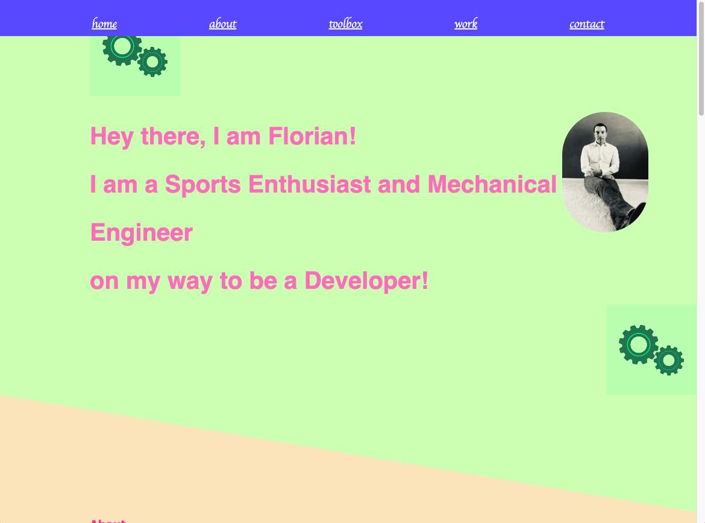

# Flo2009PortfolioPage

## Description

- I could use the learned skills in HTML and CSS in a real-life project
- A portfolio page is a good experience to learn what it takes later on to represent one-self
- I learned how to build my first webpage from scratch. Learned how to use the HTML elemets and after that combine that with styling.

## Usage

The page has a navigation on top that brings you to the different sections. The main project image is a bit bigger. The image is also a link to the deployed web-page

## Credits

This web-page inspired the layout:
https://anniebombanie.com

I used MDN web docs as help with code: 

https://anniebombanie.com/#skills-tools

As well as:

https://www.w3schools.com/css/

## License

MIT license was used

